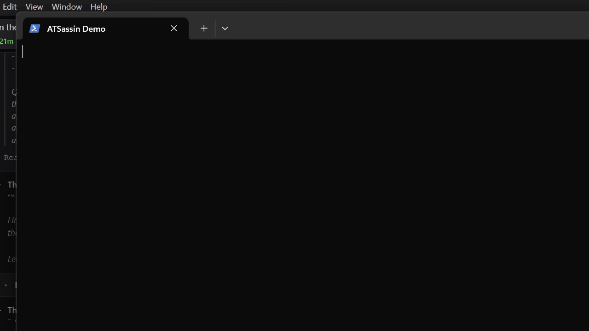

# ATSassin

[](https://github.com/Celerio-sg/ATSassin/actions/workflows/ci.yml)
[](LICENSE)
[](https://github.com/Celerio-sg/ATSassin/contribute)
[](https://github.com/Celerio-sg/ATSassin/issues?q=is%3Aissue+is%3Aopen+label%3A%22help+wanted%22)
[](https://github.com/Celerio-sg/ATSassin)
[](https://github.com/sponsors/simonbrender)

> The silent killer of bad job matches.

ATSassin is a lightweight, privacy-first, local-first job search assassin. It parses your CV, LinkedIn export, and portfolio to dynamically infer suitable roles, deep-research markets, score jobs with ATS accuracy, tailor resumes and cover letters, and track your pipeline — all on your machine with Ollama or your favorite local LLM.

> ⭐ **If ATSassin saves you time or helps you land a better role, please [give it a star on GitHub](https://github.com/Celerio-sg/ATSassin)** — it keeps the project visible and free for everyone.

## 🚀 Want to contribute?

We'd love your help. This project is building a **free, autonomous earning optimizer for everyone** — and that only works if the community owns it.

- **First time?** Check out [`good first issue`](https://github.com/Celerio-sg/ATSassin/contribute) for small, self-contained tasks.
- **Not sure where to start?** Read [`CONTRIBUTING.md`](CONTRIBUTING.md) and say hello in [Discussions](https://github.com/Celerio-sg/ATSassin/discussions) (or open an issue — we read everything).
- **Found a bug or have an idea?** [Open an issue](https://github.com/Celerio-sg/ATSassin/issues/new/choose) — no patch required.
- **Security concern?** See [`SECURITY.md`](SECURITY.md) — please don't file it publicly.

## Demo



A real-time terminal walkthrough of `atsassin profile init → scan → evaluate → tailor → tui`, recorded directly on a Windows host. The animation uses a fully synthetic, anonymised profile — no real personal information is shown. For details on how the recording was made, see [docs/DEMO_RECORDING.md](docs/DEMO_RECORDING.md).

## Job-Securing Playbook

See [PLAYBOOK.md](PLAYBOOK.md) for the integrated APAC-focused playbook covering recruiter outreach, referrals, contract platforms, personal branding, and interview prep.

## Why ATSassin? (and why contribute)

- **Dynamic role inference**: one input (resume/LinkedIn/portfolio) -> 5-10 inferred role archetypes with market demand and compensation bands
- **Local-first**: 100% local inference via Ollama; optional cloud swap (Groq, OpenRouter, OpenAI, Anthropic, Kimi, GLM, Lightning)
- **Hardware-adaptive**: runs on a 4GB laptop CPU, 8GB integrated graphics, or 32GB workstation
- **Single binary**: `cargo build --release` and you're done — no Docker, no Python, no Node
- **Privacy**: SQLite on disk, zero telemetry, zero SaaS, zero third-party account required

**Why this matters:** most job-search tooling is either expensive SaaS, opaque black-box AI, or sells your data. ATSassin is an open, local-first alternative that stays under your control. If you care about **privacy**, **open-source tooling**, **local AI**, or **democratizing access to better job outcomes**, there's a good chance your skills can help.

## Quick Start

```bash
# One-liner
curl --proto '=https' --tlsv1.2 -fsSL https://raw.githubusercontent.com/Celerio-sg/ATSassin/main/scripts/install.sh | bash

# Or manual
git clone https://github.com/Celerio-sg/ATSassin.git && cd ATSassin
cargo build --release
cp .env.example .env
./target/release/atsassin profile init --resume profile.md
./target/release/atsassin roles infer
```

## Commands

| Command | Description |
|---------|-------------|
| `atsassin profile init --resume <file>` | Parse resume, LinkedIn export, or portfolio URL |
| `atsassin profile show` | Print the parsed profile (name, email, location, summary, skills, experience) |
| `atsassin roles infer` | Dynamically infer suitable role archetypes from the profile |
| `atsassin roles list` | List previously-inferred roles from the database (no fresh LLM call) |
| `atsassin roles research --role <title>` | Synthesize market insights for a target role from scraped data |
| `atsassin scan --role <query>` | Scan job boards for matching roles. Default boards: `linkedin`, `seek` (or `seek:sg`/`seek:nz`/`seek:hk` per issue #13), `companies` (a curated Greenhouse directory that includes APAC entries per issue #14), `social`. Also available via `--boards`: `indeed`, `glassdoor` (best-effort, usually blocked) and `greenhouse:<slug>` / `lever:<slug>` / `ashby:<slug>` for a single ATS-hosted company |
| `atsassin scan --role <query> --prefs-only` | Same as `scan`, but only show/save jobs matching your saved preferences |
| `atsassin scan --role <query> --location <loc>` | Pin the location so LinkedIn's guest API doesn't silently default to US |
| `atsassin preferences show` / `set` | View or set comp floor, employment type, and work-mode preferences used to filter scans and the TUI job table |
| `atsassin evaluate --job-id <id>` / `--file <jd.txt>` | ATS-score a job against your profile |
| `atsassin tailor --job-id <id>` / `--file <jd.txt>` | Generate tailored resume + cover letter (and persist them with the job's record) |
| `atsassin pipeline list` | Track applications in SQLite |
| `atsassin pipeline add --job-id <id> --status <status>` | Add a job to the pipeline |
| `atsassin pipeline update --job-id <id> --status <status> [--notes] [--contact] [--follow-up YYYY-MM-DD]` | Update tracking fields for a pipeline entry (issue #10: terminal-status transitions feed the feedback/calibration table) |
| `atsassin pipeline show --job-id <id>` | Show a job's description, status, and the resume/cover letter that was submitted |
| `atsassin pipeline export --output file.csv` | Export the pipeline to CSV |
| `atsassin recommend --limit <n>` | Rank every pooled job by composite "likely to land quickly" score (from relevance + prefs + recency + LLM eval + contract signal) |
| `atsassin distill --output <dir>` | Export training pairs for self-fine-tuning |
| `atsassin feedback record / stats / recent / should-escalate` | Self-optimization telemetry (acceptance rate, edit distance, escalation heuristic) |
| `atsassin market stats` | Illustrative APAC tech hiring estimates (see issue #4 - not yet a sourced/verified dataset) |
| `atsassin market rates --role <title>` | Illustrative compensation benchmarks (same caveat) |
| `atsassin tui` | Terminal dashboard - infer roles, scan, evaluate, and tailor without leaving it (`e`/`t`/`s`/`r`, `p` to toggle preference filter, `x` to sort by local relevance) |
| `atsassin playbook` | Print the bundled APAC-focused playbook |
| `atsassin apply --job-id <id> [--output <dir>]` | Write a bookmarklet + JS snippet that fills known application-form fields from a job's saved resume/cover letter. Never clicks submit — you always review and send the application yourself |
| `atsassin companies discover --name <name> --domain <domain>` / `list` | Detect which ATS (Greenhouse/Lever/Ashby/Workday) a company's public careers page uses, and persist it so future `scan --boards companies` sweeps include it (issue #1) |
| `atsassin outcomes connect --server <host> --username <user> --password <pw>` | Store IMAP credentials in the OS keychain. **Opt-in only** — nothing reads your mailbox unless you run this and `outcomes sync` yourself |
| `atsassin outcomes sync --server <host> --username <user> [--password <pw>]` | Read ATS outcome emails (rejection/interview/offer) via IMAP and update matching pipeline entries. Off by default; requires `outcomes connect` first |
| `atsassin compute status` | Show the Compute Broker's provider registry and cached self-reported quota. Recommends free/configured providers but never switches providers automatically |
| `atsassin daemon [--interval <secs>] [--once]` | Optional background loop that reruns `scan` on a timer. Refuses to run on hardware below the `balanced` tier (recommends cron instead) — never resident on low-spec machines |
| `atsassin telemetry archive [--days <n>]` | Compress telemetry rows older than N days into a separate cold zstd archive table, keeping the hot journal small |

## Compensation and market data disclaimer

Salary ranges, demand percentages, and other market figures surfaced by `atsassin market` are **illustrative and LLM-derived / statically estimated**. They are intended as directional guidance only. Always verify compensation against authoritative sources (pay-scale surveys, local labour data, recruiter conversations, and the specific offer in front of you) before negotiating or making decisions.

## Hardware Modes

| Mode | Model | Context | CPU OK | Min RAM |
|------|-------|---------|--------|---------|
| `light` | `qwen3.5:4b` | 4096 | yes | 4 GB |
| `balanced` | `qwen3.5:9b` | 8192 | yes | 8 GB |
| `full` | `qwen3.5:9b:q6` | 32768 | no | 16 GB |

## `--preset` and cloud providers (issue #3, surfaced as a callout)

When using a hosted cloud provider (`LLM_PROVIDER=groq`, `kimi`, `lightning`, `glm`, `openai`, `anthropic`, `openrouter`), the `--preset` flag does **not** change which model is queried. The model name is fixed in your `.env` (e.g. `GROQ_MODEL=llama-3.3-70b-versatile`). `--preset` only changes:

- request timeout,
- retry backoff,
- scrape-result limits per board.

If you want `--preset balanced` to mean "smaller / cheaper model on Groq" rather than "more timeouts", that's a future enhancement - cloud providers currently have a single configured model rather than a tier mapping.

## Multi-region job boards (issues #13 and #14)

`atsassin scan` defaults to the Australian Seek and a US-centric `companies` directory. To route to a different region:

- `--boards seek:sg` (Singapore Seek), `:nz` (NZ), `:hk` (HK) — routes Seek through the right chalice-search `siteKey` (issue #13). The same chalice-search endpoint serves every Seek market; before this fix the adapter hardcoded the Australian siteKey so SG/HK/NZ candidates got 0 jobs.
- `--boards companies` — the curated Greenhouse directory, which now includes APAC entries (issue #14) so SG/HK/JP/AU/IN candidates no longer get a zero-board result.

## Work-mode matching (issue #12, surfaced for SG/JP/APAC candidates)

`preferences set --work-mode remote` accepts APAC-friendly phrasing — not just the English literal "remote". The matcher also recognises: telecommuting, telework, work from anywhere, WFA, home-based, smart working, plus the Japanese (リモート / 在宅 / ハイブリッド) and Chinese (在家办公) equivalents. `HybridOrRemote` further accepts "Hybrid (Singapore)", "flex work", and similar.

## Board-health canary (issue #8)

A scheduled GitHub Action (`/.github/workflows/board_health.yml`) sweeps every supported board daily and opens a tracking issue if any board mysteriously returns 0 jobs. Useful for catching JSON-shape drift before a real user hits it on a Thursday morning scan.

## CLI-documentation coverage (issue #9)

`scripts/check_cli_docs.sh` asserts every `Commands::` variant in `src/cli.rs` is mentioned in this README. CI gates on it. Cheap to maintain.

## Setup

1. Install [Ollama](https://ollama.com).
2. Pull models for your tier: `bash scripts/setup_ollama.sh`
3. Configure `.env` with your Ollama endpoint.
4. Run `atsassin profile init --resume resume.md`.

## Contributing

Contributions are genuinely wanted, not just tolerated — the goal is to make good job-search tooling free and accessible to anyone.

-  **[CONTRIBUTING.md](CONTRIBUTING.md)** — setup, conventions, and how to pick your first issue
- 🗺️ **[docs/ROADMAP.md](docs/ROADMAP.md)** — known gaps and the direction of travel
-  **[docs/CRITICAL_CHAIN_PLAN.md](docs/CRITICAL_CHAIN_PLAN.md)** — how the experimental LoRA-sharing work is sequenced
- 🏷️ **[good first issue](https://github.com/Celerio-sg/ATSassin/contribute)** — small, self-contained starter tasks
- 🏷️ **[help wanted](https://github.com/Celerio-sg/ATSassin/issues?q=is%3Aissue+is%3Aopen+label%3A%22help+wanted%22)** — larger tasks that need community help
- 💬 **[Discussions](https://github.com/Celerio-sg/ATSassin/discussions)** — questions, ideas, and casual chat
- 🛡️ **[SECURITY.md](SECURITY.md)** — for security reports (please don't file them as public issues)

This project follows the [Contributor Covenant](CODE_OF_CONDUCT.md).

## Community and ecosystem

- **First-time?** Say hello in issue [#53 — Welcome, first-time contributors!](https://github.com/Celerio-sg/ATSassin/issues/53) and a maintainer will help you find your first task.
- **Real-time chat**: [Discord](https://discord.gg/PwwnemcAy) — casual questions, pairing, and community updates.
- **Channel guide**: [docs/COMMUNITY.md](docs/COMMUNITY.md) — where to ask questions, discuss ideas, and avoid duplication.
- **Awesome ATSassin**: [docs/AWESOME.md](docs/AWESOME.md) — plugins, integrations, and resources built by the community.
- **Help us submit to awesome lists**: issue [#55 — Submit ATSassin to awesome lists](https://github.com/Celerio-sg/ATSassin/issues/55).

## Support ATSassin

ATSassin is free, open-source, and independent. If the tool has saved you time, helped you avoid a SaaS subscription, or improved your job search, consider [sponsoring the project on GitHub](https://github.com/sponsors/simonbrender).

Sponsorship keeps the core tool free for everyone, funds CI and low-spec hardware testing, and supports the review and mentorship that keeps the community growing.

-  [Become a GitHub Sponsor](https://github.com/sponsors/simonbrender)
- 📄 [Read the full sponsorship strategy](docs/SPONSORS.md)

## License

MIT — see [LICENSE](LICENSE).
